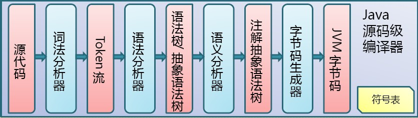
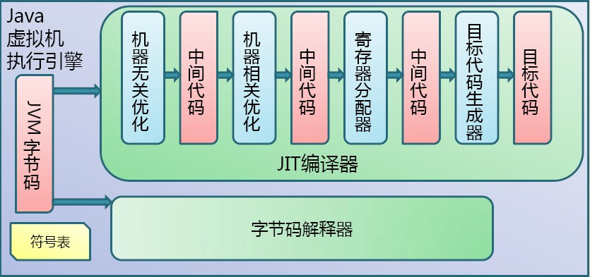
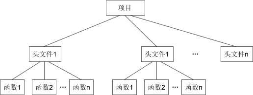
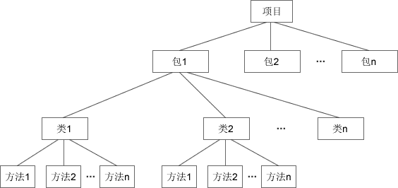

#### 基础概念

##### Java虚拟机（Java Virtual Machine，简称 JVM）

Java 源码，经过编译器编译后生成 .class 字节码文件



JVM 将字节码文件翻译成特定平台下的机器码然后运行



注：编译的结果是生成字节码，字节码不能直接运行，必须通过 JVM 翻译成机器码才能运行。不同平台下编译生成的字节码是一样的，但是由 JVM 翻译成的机器码却不一样。

注：跨平台的是 Java 程序，不是 JVM 。JVM是用C/C++开发的，不能跨平台，不同平台下需要安装不同版本的 JVM。

相关书籍：《深入理解 Java 虚拟机》

##### J2SE、J2EE和J2ME

J2SE(Java 2 Platform Standard Edition) 标准版
J2SE 是 Java 的标准版，主要用于开发客户端（桌面应用软件），如：常用的文本编辑器、下载软件、即时通讯工具等。

J2SE 包含了 Java 的核心类库，如数据库连接、接口定义、输入/输出、网络编程等。

J2EE(Java 2 Platform Enterprise Edition) 企业版
J2EE 是功能最丰富的一个版本，主要用于开发高访问量、大数据量、高并发量的网站，如：美团、去哪儿网的后台。通常所说的 JSP 开发就是 J2EE 的一部分。

J2EE 包含 J2SE 中的类，还包含用于开发企业级应用的类，如EJB、servlet、JSP、XML、事务控制等。

J2EE 也可以用来开发技术比较庞杂的管理软件，例如ERP系统（Enterprise Resource Planning，企业资源计划系统）。

J2ME(Java 2 Platform Micro Edition) 微型版
J2ME 只包含 J2SE 中的一部分类，受平台影响比较大，主要用于嵌入式系统和移动平台的开发，如呼机、智能卡、手机（功能机）、机顶盒等。

在智能手机还没有进入公众视野的时候，你是否还记得你的摩托罗拉、诺基亚手机上有很多Java小游戏吗？这就是用J2ME开发的。

Java 的初衷就是做这一块的开发。

注意：Android手机有自己的开发组件，不使用 J2ME 进行开发。

Java5.0版本后，J2SE、J2EE、J2ME分别更名为Java SE、Java EE、Java ME，由于习惯的原因，我们依然称之为J2SE、J2EE、J2ME。

#### 面向对象编程(Object Oriented Programming, OOP)

Java 中的类可以看做 C 语言中结构体的升级版。
结构体是一种构造数据类型，可以包含不同的成员（变量），每个成员的数据类型可以不一样；可以通过结构体来定义结构体变量，每个变量拥有相同的性质。如：

```c
#include <stdio.h>
int main(){
    // 定义结构体 Student
    struct Student{
        // 结构体包含的变量
        char *name;
        int age;
        float score;
    };
    // 通过结构体来定义变量
    struct Student stu1;
    // 操作结构体的成员
    stu1.name = "小明";
    stu1.age = 15;
    stu1.score = 92.5;
  
    printf("%s的年龄是 %d，成绩是 %f\n", stu1.name, stu1.age, stu1.score);
    return 0;
}

运行：
小明的年龄是 15，成绩是 92.500000
```

Java 中的类也是一种构造数据类型，但是进行了一些扩展，类的成员不但可以是变量，还可以是函数；通过类定义出来的变量也有特定的称呼，叫做“对象”。如：

```java
public class Demo {
    public static void main(String[] args){
        // 定义类Student
        class Student{  // 通过class关键字类定义类
            // 类包含的变量
            String name;
            int age;
            float score;
            // 类包含的函数
            void say(){
                System.out.println( name + "的年龄是 " + age + "，成绩是 " + score );
            }
        }
        // 通过类来定义变量，即创建对象
        Student stu1 = new Student();  // 必须使用new关键字
        // 操作类的成员
        stu1.name = "小明";
        stu1.age = 15;
        stu1.score = 92.5f;
        stu1.say();
    }
}

运行：
小明的年龄是 15，成绩是 92.5
```

在 C 语言中，通过结构体名称就可以完成结构体变量的定义，并分配内存空间；
但在 Java 中，仅仅通过类来定义变量不会分配内存空间，必须使用 new 关键字来完成内存空间的分配。

类的变量：属性（通常也称成员变量），函数：方法。它们统称为类的成员。 

类可以比喻成图纸，对象比喻成产品，图纸说明了产品的参数及其承担的任务；一张图纸可以生产出具有相同性质的产品，不同图纸可以生产不同类型的产品。


使用 new 关键字，就可以通过类来创建对象，即将图纸生产成产品，这个过程叫做类的实例化，因此也称对象是类的一个实例。

注：类只是一张图纸，起到说明的作用，不占用内存空间；对象才是具体的产品，要有地方来存放，才会占用内存空间。

在 C 语言中，可以将完成某个功能的重复使用的代码块定义为函数，将具有一类功能的函数声明在一个头文件中，不同类型的函数声明在不同的头文件，以便对函数进行更好的管理，方便编写和调用。



在 Java 中，可以将完成某个功能的代码块定义为方法，将具有相似功能的方法定义在一个类中，也就是定义在一个源文件中（因为一个源文件只能包含一个公共的类），多个源文件可以位于一个文件夹，这个文件夹有特定的称呼，叫做包。



面向对象编程在软件执行效率上绝对没有任何优势，它的主要目的是方便程序员组织和管理代码，快速梳理编程思路，带来编程思想上的革新。

##### 访问修饰符（访问控制符）

修饰符 | 说明
------|------
public | 共有的，对所有类可见。
protected | 受保护的，对同一包内的类和所有子类可见。
private   | 私有的，在同一类内可见。
默认      | 在同一包内可见。默认不使用任何修饰符。

public：类、方法、构造方法和接口能够被任何其他类访问。类的继承性，类所有的公有方法和变量都能被其子类继承。

protected：不能修饰类和接口，方法和成员变量能够声明为protected，但是接口的成员变量和成员方法不能声明为protected。
子类能访问protected修饰符声明的方法和变量，这样就能保护不相关的类使用这些方法和变量。

private：方法、变量和构造方法只能被所属类访问，并且类和接口不能声明为private。
声明为私有访问类型的变量只能通过类中公共的Getter/Setter方法被外部类访问。
主要用来隐藏类的实现细节和保护类的数据。

默认：接口里的变量都隐式声明为public static final，而接口里的方法默认情况下访问权限为public。

方法继承规则：

    父类中声明为public的方法在子类中也必须为public。

    父类中声明为protected的方法在子类中要么声明为protected，要么声明为public。不能声明为private。

    父类中默认修饰符声明的方法，能够在子类中声明为private。

    父类中声明为private的方法，不能够被继承。

##### 变量的作用域：类级、对象实例级、方法级、块级。

类级变量/全局级变量/静态变量：需要使用static关键字修饰。类级变量在类定义后就已经存在，占用内存空间，可以通过类名来访问，不需要实例化。

对象实例级变量：成员变量，实例化后才会分配内存空间，才能访问。

方法级变量：在方法内部定义的变量，就是局部变量。

块级变量：定义在一个块内部的变量（指由大括号包围的代码），变量的生存周期就是这个块，出了这个块就消失了，比如 if、for 语句的块。

```java
public class Demo {
    public static String name = "demo";  // 类级变量
    public int i;  // 对象实例级变量
    // 属性块，在类初始化属性时候运行
    {
        int j = 2;  // 块级变量
    }
    public void test1() {
        int j = 3;  // 方法级变量
        if(j == 3) {
            int k = 5;  // 块级变量
        }
        // 这里不能访问块级变量，块级变量只能在块内部访问
        System.out.println("name=" + name + ", i=" + i + ", j=" + j);
    }
    public static void main(String[] args) {
        // 不创建对象，直接通过类名访问类级变量
        System.out.println(Demo.name);
       
        // 创建对象并访问它的方法
        Demo t = new Demo();
        t.test1();
    }
}

运行：
demo
name=demo, i=0, j=3
```

##### 方法重载(method overloading)

方法重载：同一个类中的多个方法有相同的名字，但它们的参数列表不同。

不同包括：个数、类型和顺序。
- 仅仅参数变量名称不同是不可以的。
- 跟成员方法一样，构造方法也可以重载。
- 声明为 final 的方法不能被重载。
- 声明为 static 的方法不能被重载，但是能够被再次声明。

重载的规则：
- 方法名称必须相同。
- 参数列表必须不同。
- 方法的返回类型可以相同也可以不相同。
- 仅仅返回类型不同不足以成为方法的重载。

重载是面向对象的一个基本特性。

```java
public class Demo{
    // 一个普通的方法，不带参数
    void test(){
        System.out.println("No parameters");
    }
    // 重载上面的方法，并且带了一个整型参数，且有整型返回值
    int test(int a){
        System.out.println("a: " + a);
		return a;
    }
    public static void main(String args[]){
        Demo obj= new Demo();
        obj.test();
        obj.test(2);
    }
}

运行：
No parameters
a: 2
```

重载的实现：方法名称相同时，编译器会根据调用方法的参数个数、参数类型等去逐个匹配，以选择对应的方法；如果匹配失败，编译器会报错，这叫做重载分辨。

##### 程序的基本运行顺序

```java
1. public class Demo{
2.    private String name;
3.    private int age;
4.    public Demo(){
5.        name = "demo";
6.        age = 3;
7.    }
8.    public static void main(String[] args){
9.        Demo obj = new Demo();
10.        System.out.println(obj.name + "的年龄是" + obj.age);
11.    }
12. }
```
顺序：
1. 先运行到第 8 行，这是程序的入口。
2. 然后运行到第 9 行，这里要 new 一个Demo，就要调用 Demo 的构造方法。
3. 就运行到第 4 行，注意：初始化一个类，必须先初始化它的属性。
4. 因此运行到第 2 行，然后是第 3 行。
5. 属性初始化完过后，才回到构造方法，执行里面的代码，也就是第 5 行、第 6 行。
6. 然后是第 9 行，表示 new 一个Demo实例完成。
7. 然后回到 main 方法中执行第 10 行。
8. 然后是第 11 行，main方法执行完毕。

总结：程序入口->类属性->构造方法

##### 包装类、拆箱和装箱详解

基本数据类型 | 对应的包装类
------------|-----------
byte        | Byte
short      | Short
int      | Integer
long      | Long
char      | Character
float      | Float
double      | Double
boolean      | Boolean

基本类型和对应的包装类相互装换：
- 装箱：由基本类型向对应的包装类转换，如把 int 包装成 Integer 类的对象；
- 拆箱：包装类向对应的基本类型转换，如把 Integer 类的对象重新简化为 int。

```java
// Java 1.5(5.0) 之前必须手动拆箱装箱
public class Demo {
    public static void main(String[] args) {
        int m = 500;
        Integer obj = new Integer(m);  // 手动装箱
        int n = obj.intValue();  // 手动拆箱
        System.out.println("n = " + n);
       
        Integer obj1 = new Integer(500);
        System.out.println("obj 等价于 obj1？" + obj.equals(obj1));
    }
}

运行：
n = 500
obj 等价于 obj1？true
```

```java
// Java 1.5(5.0) 之后系统自动拆箱装箱
public class Demo {
    public static void main(String[] args) {
        int m = 500;
        Integer obj = m;  // 自动装箱
        int n = obj;  // 自动拆箱
        System.out.println("n = " + n);
      
        Integer obj1 = 500;
        System.out.println("obj 等价于 obj1？" + obj.equals(obj1));
    }
}

运行：
n = 500
obj 等价于 obj1？true
```

#### 常用类

#### 集合

#### 异常

#### IO

#### 多线程

#### 网络编程

#### 反射