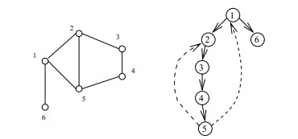

# 基本概念

类似枚举的搜索尝试过程，主要是在搜索尝试过程中寻找问题的解，当发现已不满足求解条件时，就“回溯”返回，尝试别的路径。

设想把你放在一个迷宫里，想要走出迷宫，最直接的办法是什么呢？
没错，试。先选一条路走起，走不通就往回退尝试别的路，走不通继续往回退，直到找到出口或所有路都试过走不出去为止。

# 回顾深度优先搜索

左图是一个无向图，从点1开始的DFS过程可能是下图右的情况，其中实线表示搜索时的路径，虚线表示返回时的路径：



# 基本思想与策略

在包含问题的所有解的解空间树中，按照**深度优先搜索**的策略，从根结点出发深度探索解空间树。
当探索到某一结点时，先判断该结点是否包含问题的解：
- 包含：从该结点出发继续探索下去。
- 不包含：逐层向其祖先结点回溯。

回溯法就是对隐式图的深度优先搜索算法。

- 求问题的所有解时，要回溯到根，且根结点的所有可行的子树都已被搜索遍才结束。
- 求任一个解时，只要搜索到问题的一个解就可以结束。

# 求解的基本步骤

1. 针对所给问题，定义问题的解空间；
2. 确定易于搜索的解空间结构；
3. 以深度优先方式搜索解空间，并在搜索过程中用剪枝函数避免无效搜索。

# 子集树与排列树

下面的两棵解空间树是回溯法解题时常遇到的两类典型的解空间树。

（1）从n个元素的集合S中找出满足某种性质的子集（相应的解空间树称为子集树）。


如：0-1背包问题(如上图)所相应的解空间树就是子集树，这类子集树通常有$2^n$个叶结点，其结点总个数为$2^n+1 -1$。遍历子集树的算法需时间O($2^n$)。

（2）确定n个元素满足某种性质的排列（相应的解空间树称为排列树）。


如：旅行售货员问题：

某售货员要到4个城市去推销商品，已知各城市之间的路程，请问他应该如何选定一条从城市1出发，经过每个城市一遍，最后回到城市1的路线，使得总的周游路程最小？


该题的解空间树就是排列树，这类排列树通常有n!个叶结点。遍历子集树的算法需时间O(n!)。

# 基本框架

```java
class BackTrack {
    // 原空间
	public static int[] originalCurrentAnswer;

	public BackTrack(int[] originalCurrentAnswer) {
		BackTrack.originalCurrentAnswer = originalCurrentAnswer;
	}
	
	/*
	 * 回溯法
	 * @param currentAnswer 当前解空间
	 * @param currentDepth 当前搜索深度
	 * @param args 其他参数
	 */
	public static void backTrack(int[] currentAnswer, int currentDepth, String[] args) {
		// 判断当前的部分解向量
        // currentAnswer[1...currentDepth]是否是一个符合条件的解
		if (isAnswer(currentAnswer, currentDepth, args)) {
			// 对于符合条件的解进行处理，通常是输出、计数等
			dealAnswer(currentAnswer, currentDepth, args);
		} else {
			// 根据当前状态，构造这一步可能的答案
			int[] possibleAnswer = buildPossibleAnswer(currentAnswer, currentDepth, args);
			int possibleAnswerLength = possibleAnswer.length;
			for (int i = 0; i < possibleAnswerLength; i++) {
				currentAnswer[currentDepth] = possibleAnswer[i];
				// 前者将采取的选择更新到原始数据结构上，后者把这一行为撤销。
				make(currentAnswer, currentDepth, args);
				// 剪枝
				if (pruning(currentAnswer, currentDepth, args)) {
					backTrack(currentAnswer, currentDepth + 1, args);
				}
				unmake(currentAnswer, currentDepth, args);
			}
		}
	}
}
```

# 经典题型

## 求集合的所有子集


对于每个元素都有选和不选两种路径（1选，0不选）
解空间就是集合选与不选的状态，这里初始是｛0，0，0｝，也是问题的一个解，空集。
这里没有剪枝（具体问题具体加），直接就是深度搜索，直到当前深度等于集合的大小，就可以输出了。

```java
class BackTrack {
	public static int[] originalCurrentAnswer;

	public BackTrack(int[] originalCurrentAnswer) {
		BackTrack.originalCurrentAnswer = originalCurrentAnswer;
	}
    
	public static void backTrack(int[] currentAnswer, int currentDepth) {
		if (isAnswer(currentAnswer, currentDepth)) {
			dealAnswer(currentAnswer, currentDepth);
		} else {
			int[] possibleAnswer = buildPossibleAnswer(currentAnswer, currentDepth);
			int possibleAnswerLength = possibleAnswer.length;
			for (int i = 0; i < possibleAnswerLength; i++) {
				currentAnswer[currentDepth] = possibleAnswer[i];
                backTrack(currentAnswer, currentDepth + 1);
			}
		}
	}

	private static boolean isAnswer(int[] currentAnswer, int currentDepth) {
        // 当前搜索深度已达到原空间的深度
		return currentDepth == originalCurrentAnswer.length;
	}
    
    /*
     * 按位对应
     * 如集合A={a,b}
     * 对于任意一个元素，在每个子集中，要么存在，要么不存在 
     * 映射为子集： 
     * (1,1)->(a,b) (1,0)->(a) (0,1)->(b) (0,0)->空集
     */
	private static int[] buildPossibleAnswer(int[] currentAnswer, int currentDepth) {
		// 选or不选即 1, 0
		int[] isChosen = { 1, 0 };
		return isChosen;
	}

	private static void dealAnswer(int[] currentAnswer, int currentDepth) {
		for (int i = 0; i < currentDepth; i++) {
            // 如果选，则输出
			if (currentAnswer[i] == 1) {
				System.out.print(originalCurrentAnswer[i] + " ");
			}
		}
		System.out.println();
	}
}
```

## 求全排列


交换两个位置的值，然后进入下一个深度，直到当前深度达到序列的长度。

```java
public static void backTrack(char[] currentAnswer, int currentDepth, int length) {
    if (currentDepth == length) {
        System.out.println(new String(currentAnswer));
    } else {
        for (int i = currentDepth; i < length; i++) {
            if (isUnique(currentAnswer, currentDepth, i)) { // 剪枝（去重）
                swap(currentAnswer, currentDepth, i); // 交换元素
                backTrack(currentAnswer, currentDepth + 1, length);
                swap(currentAnswer, currentDepth, i); // 还原
            }
        }
    }
}

private static boolean isUnique(char[] currentAnswer, int currentDepth, int k) {
    for (int i = currentDepth; i < length; i++)
        if (currentAnswer[i] == currentAnswer[k])
            return false;
    return true;
}

private static void swap(char[] currentAnswer, int m, int n) {
    char tmp = currentAnswer[n];
    currentAnswer[n] = currentAnswer[m];
    currentAnswer[m] = tmp;
}
```

## 八皇后问题

将八个皇后摆在一张8*8的国际象棋棋盘上，使每个皇后都无法吃掉别的皇后，一共有多少种摆法？

> 在国际象棋中，皇后是最强大的一枚棋子，可以吃掉与其在同行、同列和同斜线的敌方棋子

一种可能的情况：


1. 从空棋盘起，逐行放置棋子。 
2. 每在一个布局中放下一个棋子，即推演到下一个新的布局。 
3. 如果当前行上没有可合法放置棋子的位置，则回溯到上一行，重新布放上一行的棋子。

```java
class BackTrack {
	public static int count = 0;
	public static int DIM;

	public BackTrack(int DIM) {
		BackTrack.DIM = DIM;
	}

	public static void backTrack(int[][] chess, int row, int[] isColumnCollision) {
		if (isAnswer(row)) {
			dealAnswer(chess);
		} else {
			for (int i = 0; i < DIM; i++) {
                // 同列存在皇后
                // 或同对角线存在皇后
                // 因为每次都是新的一行，所以不用检查行是否存在皇后
				if (isColumnCollision[i] == 1 || isDiagonalCollision(chess, row, i))
					continue;
				chess[row][i] = 1;
				isColumnCollision[i] = 1;
				backTrack(chess, row + 1, isColumnCollision);
				chess[row][i] = 0;
				isColumnCollision[i] = 0;
			}
		}
	}
    
    // 同对角线是否冲突
	private static boolean isDiagonalCollision(int[][] chess, int x, int y) {
        // 以当前皇后坐标为起点，到左上角的对角线
		for (int i = x - 1, j = y - 1; i >= 0 && j >= 0; i--, j--)
			if (chess[i][j] == 1)
				return true;
        // 到右上角的对角线
		for (int i = x - 1, j = y + 1; i >= 0 && j < DIM; i--, j++)
			if (chess[i][j] == 1)
				return true;
		return false;
	}

	private static boolean isAnswer(int row) {
		return row == DIM;
	}

	private static void dealAnswer(int[][] chess) {
		count += 1;
		for (int i = 0; i < DIM; i++) {
			for (int j = 0; j < DIM; j++) {
				System.out.print(chess[i][j] + " ");
			}
			System.out.println();
		}
		System.out.println();
	}
}
```

参考文章：
- [回溯法与八皇后问题](https://www.cnblogs.com/bigmoyan/p/4521683.html)

## 火力网问题

在一个n*n的网格里，每个网格可能为“墙壁”（用x表示）和“街道”（用o表示）。现在在街道放置碉堡，每个碉堡可以向上下左右四个方向开火，子弹射程无限远。墙壁可以阻挡子弹。问最多能放置多少个碉堡，使它们彼此不会互相摧毁。

如下图，墙壁用黑正方形表示，街道用空白正方形表示，圆球就代表碉堡。


1、2、3可行，4、5不可行。因为4、5的两个碉堡同行、同列，他们会互相攻击。

类似八皇后问题

参考文章：
- [回溯算法（解火力网问题）](https://www.cnblogs.com/Creator/archive/2011/05/20/2052341.html)